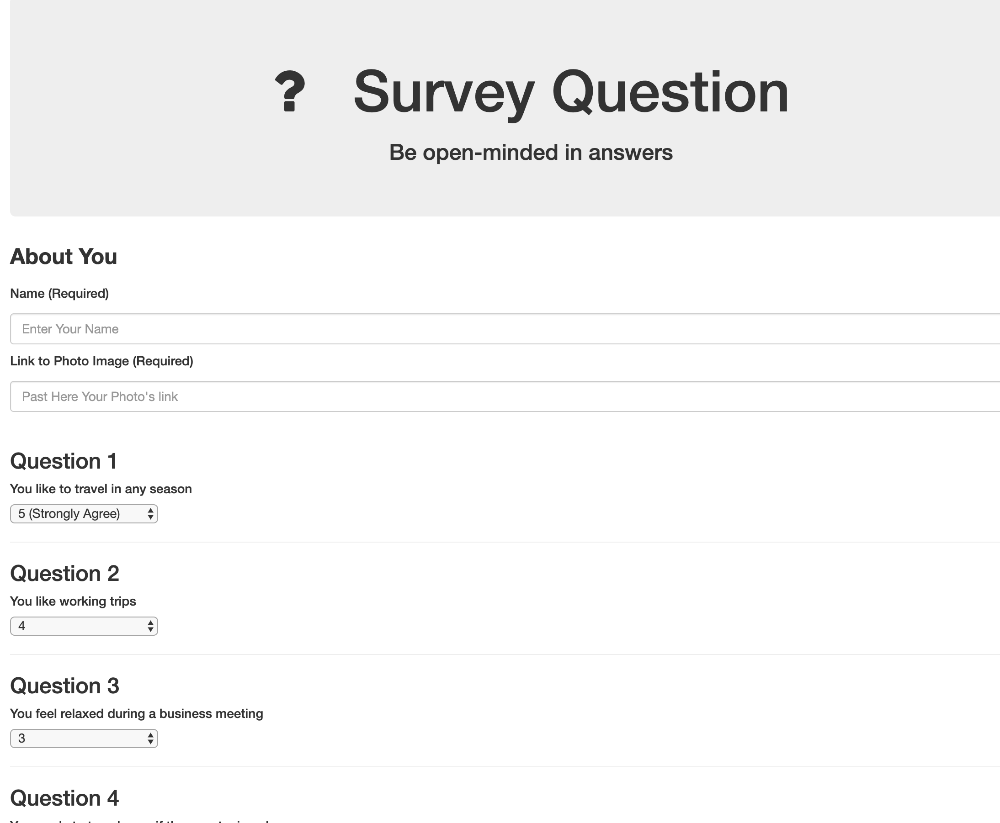

# FriendFinder

## Heroku link 

https://whispering-scrubland-21865.herokuapp.com/

## Description

Friend Finder implements friend matching based on the user's responses to a 8 question survey. The user responds to questions with values from 1 (Strongly Disagree) to 5 (Strongly Agree). When the survey is submitted, an existing user record closest to the current user's responses is found and returned. The closest set of user responses is defined as the set with the lowest absolute difference for all ten questions combined.

The application is implemented using a Node.js and Express server on the back end and the Materialize CSS framework on the front end.

## Screen

## Using

* HTML5
* CSS3
* Bootstrap
* JavaScript
* NodeJS
* MySQL
* NPM 
    * express
    * path

## Author

* **Arman Bareyan** [ABareyan](https://github.com/ABareyan)

## License

No license agreements. 